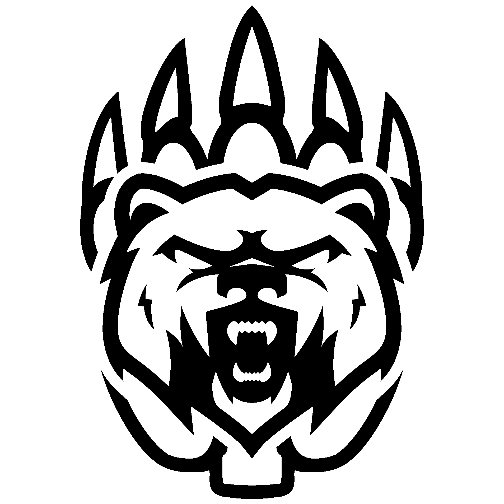

<p align="center">
  
</p>

<h1 align="center">RoaringBot</h1>

<p align="center">
  <strong>Discord bot for the Roaring Bears e.V. Discord server</strong> — match tracking,
  CS live-score overlays, birthday announcements, finance reports, and
  moderation. Built with discord.py and PostgreSQL, deployed via Docker.
</p>

<p align="center">
  <a href="https://discord.gg/roaringbears">
    
  </a>
  <a href="https://wannspieltbig.de">
    
  </a>
  <a href="https://casparsadenius.de/status/roaringbot">
    
  </a>
</p>

<p align="center">
  
  
  
</p>

---

## Features

| | | |
|---|---|---|
| **Esports** | Match tracking powered by [wannspieltbig.de](https://github.com/ckarrie/ckw-csgo) by [ckarrie](https://github.com/ckarrie) — Discord scheduled events, CS live-score CV2 overlays, 30-min reminders with versus images, weekly summaries |
| **Birthday** | Daily birthday posts at 10:00 Europe/Berlin with age tracking, sourced from Google Sheets |
| **Moderation** | Member join/leave logging via webhook, auto-join role, honeypot and bot-trap protection, `/clear` bulk-delete |
| **Feedback** | `/feedback` slash command with CV2 modal (subject, anonymity toggle), REST API consumed by the dashboard |
| **Finance** | Monthly Kassenbuch report on the 1st of each month, parsed from Google Sheets with German currency formatting |

## Quick Links

- **[DATA_INTERFACE.md](DATA_INTERFACE.md)** — API and status JSON contract for dashboard consumers
- **[CLAUDE.md](CLAUDE.md)** — detailed architecture, key invariants, and development guide

## Architecture

```
cogs/               Discord cogs (one file per feature)
  esports.py        Match tracking, reminders, CS live-score, weekly summary
  birthday.py       Daily birthday announcements
  moderation.py     Member logging, honeypot, bot-trap, /clear
  feedback.py       /feedback slash command + CV2 modal
  finance.py        Monthly Kassenbuch report

core/               Business logic
  config.py         Env-based config accessors
  api_server.py     aiohttp REST API (port 8080)
  status_reporter.py  Atomic data/status.json writer (15 s interval)
  http_client.py    aiohttp pool with retry/backoff
  colors.py         Discord colour constants

db/                 PostgreSQL via asyncpg, repository pattern
resources/          Static images (logo.png, big.png, big_square.png, pb.png)
scripts/            One-shot data migration scripts
```

Logs are written to ``logs/`` with daily rotation and 30-day retention.
Errors and warnings feed the dashboard via ``ErrorTrackerHandler`` (see
``bot.py``) — counters and a rolling error log are exposed in status.json.

| Container | Role | Port |
|---|---|---|
| `roaringbot` | Discord bot + REST API | :8080 (internal) |
| `roaringbot-db` | PostgreSQL 16 | --- |

## Self-Hosting

### Prerequisites

- Docker and Docker Compose
- A [Discord Bot Application](https://discord.com/developers/applications) with token
- (Optional) Google Sheets service account for birthday and finance features
- (Optional) [wannspieltbig.de](https://wannspieltbig.de) API credentials for esports

### Setup

```bash
# 1. Clone the repo
git clone https://github.com/spa1teN/RoaringBot.git
cd RoaringBot

# 2. Configure environment
cp .env.example .env
# Edit .env — set DISCORD_TOKEN and DB_PASSWORD at minimum

# 3. Start the bot
docker compose up -d --build

# 4. Check health
docker compose logs roaringbot --tail 20
curl -s http://localhost:8080/api/bot/avatar  # should return JSON
```
